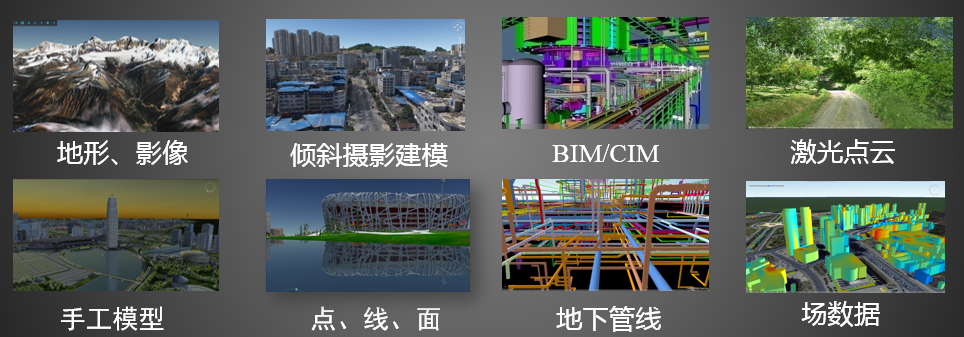

*Version 1.0*

S3M (Spatial 3D Model)是一种开放式、可扩展的三维地理空间数据格式，为海量多源异构空间三维模型数据在不同终端之间的传输、交换与共享提供数据格式的具体规范

# 简介

《空间三维模型数据格式》(S3M) (T/CAGIS 1-2019)是中国地理信息产业协会发布的第一个团体标准，已于2019年8月31日正式实施。

该标准由中国地理信息产业协会提出，自然资源部信息中心、国家基础地理信息中心、北京超图软件股份有限公司、中国城市规划设计研究院、中国建筑科学研究院有限公司等12家单位共同起草，并通过了以中国工程院院士刘先林为组长的标准审查组评审，专家组一致认为：该标准具有先进性和适用性，对于推动我国三维地理空间数据的共享及深入应用具有重要作用。

《空间三维模型数据格式》团体标准定义了一种开放式可扩展的三维地理空间数据格式——Spatial 3D Model（S3M），对倾斜摄影模型、人工建模数据、BIM、点云、三维管线、二维/三维点线面等各类数据进行整合，适用于海量、多源异构三维地理空间数据和Web环境下的传输与解析，为多源三维地理空间数据在不同终端（移动设备、浏览器、桌面电脑）地理信息平台中的存储、高效绘制、共享与互操作等问题提供了解决方案。据悉，标准编制单位已基于本标准形成了完整的B/S及C/S架构的三维GIS应用解决方案，从数据生成、服务器端发布到多种客户端加载应用等多个环节解决用户实际问题。

《空间三维模型数据格式》团体标准的发布，为不同应用系统之间的三维数据共享和互操作提供了开放、标准、通用的数据格式基础，推动了倾斜摄影建模、激光点云、BIM等多源异构的三维数据融合，并兼容多种软硬件环境，为实景三维中国和新型智慧城市建设贡献力量，大力推动了我国三维地理空间数据资产安全可控、开放与共享的建设进程。

S3M的主要技术特点和优势可以概括为：

1）支持表达多源地理空间数据：倾斜摄影模型、BIM、人工建模、激光点云、矢量、地下管线等多源数据。

2）具备海量数据高效绘制的能力：支持LOD、批次绘制、实例化等技术，可以提升渲染性能。

3）具备单体化选择和查询能力：支持高效选择、支持批量修改对象颜色、批量修改对象可见性。

4）简洁易读：格式简洁，易解析，适用于WebGL等轻量级客户端。

5）高效传输：数据紧凑，以二进制形式保存，占用空间小，传输性能高。

6）快速载入显卡：数据结构尽可能跟OpenGL接口保持一致，减少加载时间，高性能，低消耗。

7）跨终端：独立于任何终端，适用于PC端、Web端、移动端，具有较好的兼容性。

8）可扩展性：支持扩展，允许增加一些多用途扩展或特定厂商的扩展。

9）完善的工具支撑：提供S3M数据解析和转换工具，支持3D-Tiles、OSGB等格式与S3M格式相互转换。

10）完善的配套设施：完整的解决方案，成熟的可行性，强大的实用性。基于S3M形成了完整的B/S及C/S架构的三维GIS应用解决方案，从数据生成、服务器端发布到多种客户端加载应用等多个环节解决用户实际问题。

目前，S3M标准格式在国内外多类软件平台得到应用，包括：1）倾斜摄影建模软件，如深圳珠科Altizure、东方道迩pixe3DBuilder Engine(P3BJet)、大势智慧重建大师（GET3D）、大疆智图DJI Terra、瞰景Smart3D等；2）三维可视化平台，如睿呈时代等；3）游戏引擎，如Ventuz等。并且国内外多个倾斜摄影建模软件、BIM软件及前端的三维渲染引擎正在开展对接工作。另外，华为沃土平台将S3M作为其3D GIS标准服务，对项目合作伙伴免费开放；深圳可视化城市空间数字平台将S3M作为其GIS标准服务，对深圳市各行政事业单位免费开放。

此外，2020年9月7日，经中国地理信息产业协会审查批准，《空间三维模型数据服务接口》（下称该标准）团体标准发布，并于10月7日起正式实施。该标准是T/CAGIS 1-2019的配套标准，适用于多源异构数据的网络发布与访问，支持应用系统之间的互联互访互操作。

# 效果图

# 工具
数据生成：SuperMap iDesktop，SuperMap iObjects

发布服务：SuperMap iServer

客户端：SuperMap iClient3D for WebGL，SuperMap iClient3D for Plugin，SuperMap iMobile for iOS/Android

SDK：S3M_SDK

