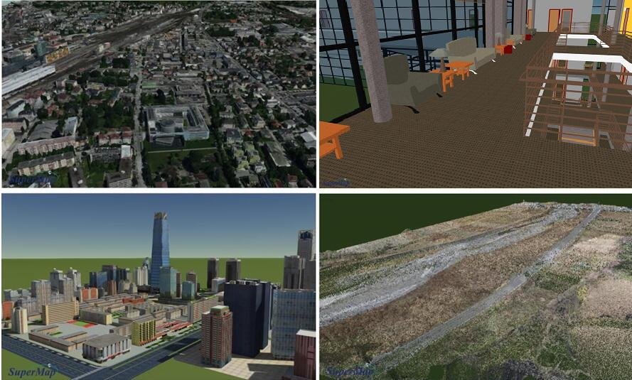
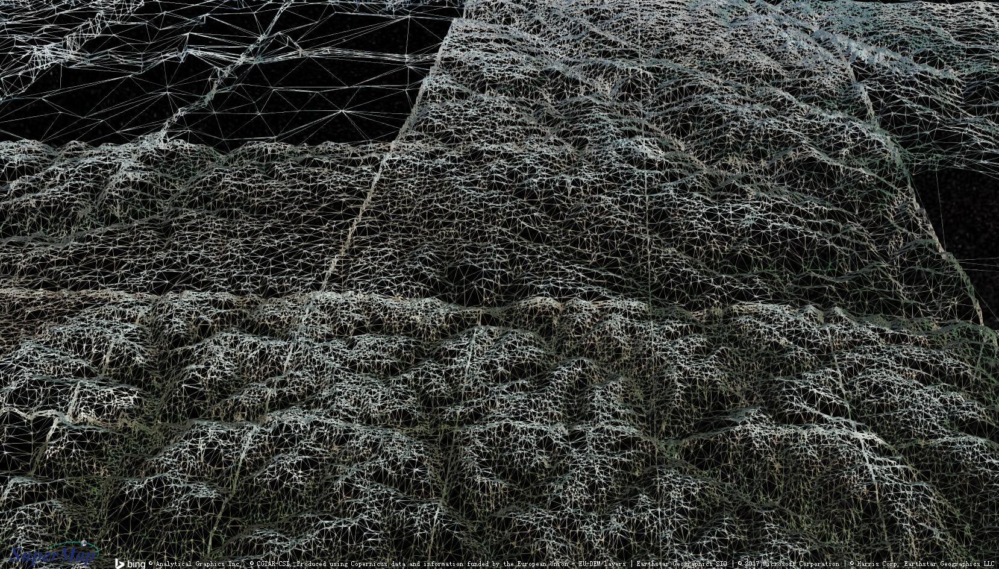
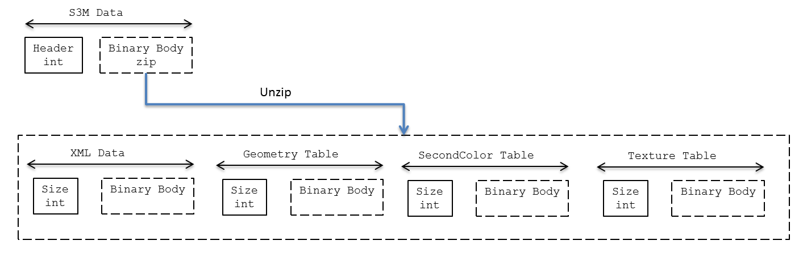

<p align="center">

</p>

*Version 1.0*

SuperMap 3D Model (S3M)是一种适用于海量三维模型数据的传输格式。它通过一种高效，易扩展，可协作的数据规范，在不同终端（移动，浏览器，桌面）之间，满足用户在三维数据传输和解析方面的各类需求。

# 效果

<p align="center">

</p>

# 示例数据

# 简介

随着倾斜技术的日趋成熟，超图三维团队形成了成熟的C/S下倾斜数据的解决方案，接下来，如何在Web端应用倾斜数据成为一个迫切的需求。OSGB数据规范很好的解决了海量三维模型数据的高效浏览，但数据结构过于复杂，性能消耗和解析时间都无法满足Web的用户体验。


同时，早期诺基亚的Here Map以自定义的数	据结构(N3M)简化了倾斜数据，通过HTML5，特别是WebGL技术，解决了城市级别倾斜数据流畅浏览等。证明在目前的硬件环境下，采用合理的技术和优化策略，可以实现Web端浏览海量三维模型数据。只是N3M是Here Map根据自身需求而对倾斜数据的简化，并不是一种数据规范。


超图三维团队在OSGB和N3M的基础上各取所长，并对倾斜数据，精模，BIM，矢量，管线，单体化，实例化等相关内容的整合，最终形成了海量三维数据规范---S3M，很好的解决了大规模三维数据在B/S下传输和解析这两大瓶颈。


当然，超图三维产品不仅仅提出S3M数据规范，而是基于该数据规范形成了一套B/S下完整的解决方案，从数据生成，服务端发布，到多种客户端加载应用等多个环节解决用户的实际问题。
S3M并不是凭空捏造出来，而是在OSGB和N3M的基础上，结合超图三维多年来在技术，产品，应用的积累而形成。总体来说，主要有以下几个特点：

* 完善的配套设施：完整的解决方案，成熟的可行性，强调实用性

* 高效传输：数据紧凑，以二进制形式保存并进行ZIP压缩，占用空间小，传输性能高

* 快速加载：数据结构尽可能跟GL接口保持一致，减少加载时间，高性能，低消耗

* 运行时独立：独立于任何终端，适用于PC，Web端，移动端，较好的兼容性

* 扩展性：支持扩展，允许增加一些多用途扩展或特定厂商的扩展能力

# 概念

## 空间坐标系

S3M采用右手坐标系，所有线性距离单位为米，坐标系仅支持WGS84坐标系。如果原始数据为非WGS84坐标系，可以通过桌面产品，在生成S3M数据时进行投影转换。

## 树结构

在空间数据结构上，S3M数据和倾斜数据的切片规范一样，通过树状结构来管理和维护。树中有一个根节点和它对应的子节点，同一级的节点之间数据量尽可能相同，在空间关系是上，父节点包含其所有子节点，并通过树的层级关系来组织和管理。


如下图，在浏览时，根据相机距离的远近，选择适合的节点切片，达到效果和效率之间的平衡。

<p align="center">

</p>

## SCP文件

``` xml
<?xml version="1.0" encoding="UTF-8"?>
<SuperMapCache xmlns:sml="http://www.supermap.com/SuperMapCache/vectorltile">
<sml:Version>1.00000</sml:Version>
<sml:FileType>OSGBFile</sml:FileType>
<sml:HeightRange>
	<sml:MaxHeight>48.945885</sml:MaxHeight>
	<sml:MinHeight>6.386441</sml:MinHeight>
</sml:HeightRange>
<sml:Position>
	<sml:X>115.000000000000000</sml:X>
	<sml:Y>40.000000000000000</sml:Y>
	<sml:Z>0.000000000000000</sml:Z>
</sml:Position>
<sml:BoundingBox>
	<sml:MinX>-1081.6277399394771</sml:MinX>
	<sml:MinY>-581.01017007240466</sml:MinY>
	<sml:MinZ>-335.26080412402422</sml:MinZ>
	<sml:MaxX>-364.71959173626021</sml:MaxX>
	<sml:MaxY>135.89797813081219</sml:MaxY>
	<sml:MaxZ>381.64734407919258</sml:MaxZ>
</sml:BoundingBox>
<sml:OSGFiles>
	<sml:Files>
	<sml:FileName>./Tile_007_009/Tile_007_009.s3m</sml:FileName>
	<sml:BoundingSphere>
		<sml:CenterX>-738.053833</sml:CenterX>
		<sml:CenterY>-521.840881</sml:CenterY>
		<sml:CenterZ>24.340384</sml:CenterZ>
		<sml:Radius>36.200244</sml:Radius>
	</sml:BoundingSphere>
	</sml:Files>
</sml:OSGFiles>
</SuperMapCache>
```

SCP是S3M数据的配置信息，以XML形式提供，主要属性如下：

* FileType：数据类型，倾斜，BIM，精模等
* Position：数据的位置，经度+纬度+高度
* BoundingBox：数据空间范围
* OSGFiles/FileName：根节点集合
* BoundingSphere：根节点空间范围

# 切片

<p align="center">

</p>

在树状结构中，每一个节点对应一个切片(Tile，后缀为s3m)。每个切片都包括四个部分：

* 表述信息，XML格式，文本形式
* 几何对象集合，二进制形式
* 单体化信息，二进制形式
* 纹理信息，二进制形式

## XML


``` xml
<Group>
	<PageLods>
		<PagedLOD>
			<Geode>
				<GeoName>30519188</GeoName>
				<GeoName>3272469703</GeoName>
				<GeoDeModMatrix />
			</Geode>
			<RangeDataList>Tile_+020_+025_L19_000020.osgb</RangeDataList>
			<RangeMode>PIXEL_SIZE_ON_SCREEN</RangeMode>
			<BoundingSphere><x>-1162.754395</x><y>-800.559265</y><z>66.624786</z><radius>48.324287</radius></BoundingSphere>
			<RangeList>386.594299</RangeList>
		</PagedLOD>
		<PagedLOD />
	</PageLods>
	<Material3Ds>
		<material>
			<name>2315486585</name>
			<Ambient><Ambient:R>1.000000</Ambient:R><Ambient:G>1.000000</Ambient:G><Ambient:B>1.000000</Ambient:B><Ambient:A>1.000000</Ambient:A></Ambient>
			<Diffuse><Diffuse:R>1.000000</Diffuse:R><Diffuse:G>1.000000</Diffuse:G><Diffuse:B>1.000000</Diffuse:B><Diffuse:A>1.000000</Diffuse:A></Diffuse>
			<Specular><Specular:R>0.000000</Specular:R><Specular:G>0.000000</Specular:G><Specular:B>0.000000</Specular:B><Specular:A>1.000000</Specular:A></Specular>
			<Shininess>0.000000</Shininess>
			<texture>
				<name>384769527</name>
				<AddressMode>
					<u>TAM_CLAMP</u>
					<v>TAM_CLAMP</v>
					<w>TAM_CLAMP</w>
				</AddressMode>
				<TextureFilteringOption>FO_NONE</TextureFilteringOption>
				<MinFilter>FO_LINEAR</MinFilter>
				<MaxFilter>FO_LINEAR</MaxFilter>
				<MipFilter>FO_POINT</MipFilter>
				<TexModMatrix>1.000000,0.000000,0.000000,0.000000,0.000000,1.000000,0.000000,0.000000,0.000000,0.000000,1.000000,0.000000,0.000000,0.000000,0.000000,1.000000</TexModMatrix>
			</texture>
		</material>
	</Material3Ds>
</Group>
```

如上是每一个S3M中的表述信息，以XML文本形式保存，里面是PageLods和Material3Ds两个集合。


PagedLOD是当前节点和子节点之间的层级关系。首先是子节点的LOD信息（下面会介绍），Geode是当前节点的几何对象信息，如下图，包括GeoName对象名，对应几何对象集合中的唯一标识，GeoDeModMatrix，该对象相对基准点的矩阵。

``` xml
<Geode>
	<GeoName>30519188</GeoName>
	<GeoName>3272469703</GeoName>
	<GeoDeModMatrix>1.000000,0.000000,0.000000,0.000000,0.000000,1.000000,0.000000,0.000000,0.000000,0.000000,1.000000,0.000000,0.000000,0.000000,0.000000,1.000000</GeoDeModMatrix>
</Geode>
```

Material3Ds中包含该节点用到的所有材质属性。每一个材质对应的属性如下：

``` xml
<Material3Ds>
		<material>
			<name>2315486585</name>
			<Ambient><Ambient:R>1.000000</Ambient:R><Ambient:G>1.000000</Ambient:G><Ambient:B>1.000000</Ambient:B><Ambient:A>1.000000</Ambient:A></Ambient>
			<Diffuse><Diffuse:R>1.000000</Diffuse:R><Diffuse:G>1.000000</Diffuse:G><Diffuse:B>1.000000</Diffuse:B><Diffuse:A>1.000000</Diffuse:A></Diffuse>
			<Specular><Specular:R>0.000000</Specular:R><Specular:G>0.000000</Specular:G><Specular:B>0.000000</Specular:B><Specular:A>1.000000</Specular:A></Specular>
			<Shininess>0.000000</Shininess>
			<texture>
				<name>384769527</name>
				<AddressMode>
					<u>TAM_CLAMP</u>
					<v>TAM_CLAMP</v>
					<w>TAM_CLAMP</w>
				</AddressMode>
				<TextureFilteringOption>FO_NONE</TextureFilteringOption>
				<MinFilter>FO_LINEAR</MinFilter>
				<MaxFilter>FO_LINEAR</MaxFilter>
				<MipFilter>FO_POINT</MipFilter>
				<TexModMatrix>1.000000,0.000000,0.000000,0.000000,0.000000,1.000000,0.000000,0.000000,0.000000,0.000000,1.000000,0.000000,0.000000,0.000000,0.000000,1.000000</TexModMatrix>
			</texture>
		</material>
	</Material3Ds>
```

Name为材质名，对应材质集合中的唯一标识，如果该材质中有纹理数据，则有texture标签，同时有一个纹理的name，对应纹理集合的唯一标识。


*备注：早期，我们把整个树状结构和LOD信息放到一个XML文件中保存，这样做有两个问题，一个是当该数据层级比较复杂时，导致文件很大，难以解析，同时一次性加载解析，性能上也不划算，因此我们将整个树状结构分解到每个节点中，该节点只保存和子节点之间的关系，深度为1.这样解析简单，做到按需解析。*

## LOD

LOD类似于影像金字塔，或二维地图层级的概念，用来负责父子节点的切换，根据当前相机的位置和节点的精细程度，来判断是否用多个子节点来替换。通常，节点深度越大，则数据越精细，范围越小，这样通过合理的LOD策略，在当前范围内实现效果和数据量之间的平衡。


S3M支持多种LOD策略，如上图的八叉树和四叉树，以及自适应等，同时在对应的端产品中提供对应的图层类来实现（比如WebGL中的S3MTilesLayer），不需要用户关系具体的调度方法。

<p align="center">

</p>

<p align="center">

</p>

LOD之间的切换是替换策略，在浏览场景时，从A节点过渡到B节点时，则渲染B节点对应的几何对象，取消甚至卸载A节点内容，并保证较好的过渡效果。

S3M中LOD具体参数如下：

* RangeDataList
  * 子节点显示精度
* RangeMode
  * LOD调度方式，目前有DISTANCE_FROM_EYE_POINT和PIXEL_SIZE_ON_SCREEN两种形式
* BoundingSphere
  * 子节点的空间范围
* RangeList
  * 子节点对应的S3M文件名，所有子节点都和根节点在同一文件夹下

## Geometry

一个切片中可以包含零个或多个几何对象，每个几何对象中包括一个顶点数据，一个或多个顶点索引数据。


几何对象以二进制形式保存和读取，支持点，线，三角网三种类型。详细信息可参考数据结构---Geometry Table部分。

## Texture

无论是文件还是显存中，纹理往往是最占空间的部分。因此S3M在纹理处理上，针对B/S使用场景，设备差异等因素，做了大量优化。


首先，S3M中纹理数据保存在文件内，这样避免了单独请求纹理数据的异步传输。其次，针对PC端，Android端，iOS端提供了纹理压缩类型的支持，优化显存占用和内存解析消耗。最后，为了提高纹理的重用，在XML属性中支持设置对应的纹理矩阵。


当然，S3M为了保证纹理效果，支持mipmap技术。纹理数据的详细结构可参考数据结构---Texture Table部分。

## 单体化信息集合

单体化数据是一张映射表，映射关系为GeoName(1)---ID(1)---[nIndex , nOffset](N),，也就是每一个几何对象，有且仅有一个唯一的ID，并记录该对象对应顶点数据中的起始位置和偏移量。根据该映射关系修改对应的属性值，达到单体化的效果。

## 实例化

*未完待续*

# 数据结构

<p align="center">

</p>

首先是版本信息，4个字节，前三个为’S, ‘3, ‘M, 第四位是版本号，目前为4（无单体化信息）和5（有单体化信息）两种情况。

## XML表述模块

``` c++
struct strXMLData
{
	// 长度
	int nSize;
	// 内容
	string strXMLContent;
}
```

## Geometry Table模块

``` c++
struct GeometryTable
{
	// 所有几何对象的字节长度
	int nPackageSize;
	// 几何对象个数
	int nGeoCount;
	// 对应的Geometry内容
	Geometry geoArray[nGeoCount];
}
```

``` c++
struct Geometry
{
	// Geometry对应的顶点数据对象
	VertexPackage m_vertexPackage;
	// Geometry顶点索引数目
	int nIndexPackageSize;
	// Geometry对应的顶点索引对象数组
	IndexPackage arrIndexPackage[nIndexPackageSize];
};
```

``` c++
struct VertexPackage
{
	// 该对象的ID
	int nGeoName;
	// 数据绘制属性
	int nVertexOptions;
	// 顶点维数
	int nVertexDimension;
	
	// 顶点数目个数
	unsigned int m_nVerticesCount;	
	// 顶点数组偏移
	unsigned short m_nVertexStride;
	// 字节对齐
	unsigned short nAlign;
	// 顶点数组内容
	float m_pVertices[m_nVerticesCount * nVertexDimension];
	
	// 向量数目个数
	unsigned int m_nNormalCount;
	// 向量数组偏移
	unsigned short m_nNormalStride;
	unsigned short nAlign;
	// 向量数目
	float m_pNormals[m_nNormalCount * nVertexDimension];
	
	// 颜色数组个数
	unsigned int m_nVertexColorCount;
	// 颜色数组偏移
	unsigned short m_nVertexColorStride;
	unsigned short nAlign;
	// 颜色数组
	float m_pVertexColor[m_nVertexColorCount];
	
	// 单体化颜色数组个数
	unsigned int m_nSecondVertexColorCount;
	// 单体化颜色数目
	float m_pSecondVertexColor[m_nSecondVertexColorCount];
	
	// 贴图坐标个数
	int nTexCount;
	// 贴图坐标对象
	TextureCoordinate texArray[nTexCount];	
};
```

``` c++
struct TextureCoordinate
{
	// 贴图坐标数目
	unsigned int m_TexCoordCount;
	// 贴图坐标维数
	unsigned short m_nTexDimensions;
	// 每组贴图坐标的偏移
	unsigned short m_TexCoordStride;
	// 贴图坐标数据
	float m_pTexCoords[m_TexCoordCount * m_nTexDimensions];
};
```

``` c++
struct IndexPackage
{
	// 索引数目
	unsigned int m_nIndexesCount;
	// 是否使用无符整型数据类型
	unsigned char m_enIndexType;
	// 是否使用索引
	bool m_bUseIndex;
	// 数据绘制的方式
	unsigned char m_OperationType;
	unsigned char nAlign;
	// 索引数组，二选一，取决于m_enIndexType
	unsigned short m_pIndexes[m_nIndexesCount];
	unsigned int m_pIndexes[m_nIndexesCount*2];
	
	// 材质数目
	int nPassCount;
	// 材质对应的哈希码
	unsigned int nPassNameHC[nPassCount];
};
```

## SecondColor Table

``` c++
struct SecondColorTable
{
	// 单体化模块长度 
	int nSecondPackageCount;
	// 单体化个数
	int nSecondColorCount;
	// 单体化数据对象
	SecondColorObj arrSecondColor[nSecondColorCount];
	
};
```

``` c++
struct SecondColorObj
{
	// 单体化对象名称
	int nGeoName;
	// 单体化映射表个数
	int nSelectIDsCount;
	// 单体化映射表对象
	SelectColorMap arrSelectColor[nSelectIDsCount];	
};
```

``` c++
struct SelectColorMap
{
	// 单体化对象ID
	int nSelectID;
	// 单体化数组长度
	int nSelectCount;
	// 单体化结构体
	SelectInfo arrSelectInfo[nSelectCount];	
};
```

``` c++
struct SelectInfo
{
	// 起始点
	int nHigInfoIndex;
	// 个数
	int nHitInfoCount;	
};
```

## Texture Table

``` c++
struct TextureDataTable
{
	// 纹理数目
	int nTextureCount;
	// 纹理对象
	TextureData arrTextureData[nTextureCount];
};
```

``` c++
struct TextureData
{
	// 纹理对应的哈希码
	unsigned int nTextureHashCode;
	// 纹理宽度
	unsigned int m_nWidth;
	// 纹理高度
	unsigned int m_nHeight;
	// 纹理压缩类型：DDS， PVR， ETC
	unsigned int m_nCompressType;
	// 纹理大小
	unsigned int m_nSize;
	// 纹理的像素类型：RGBA
	int m_nFormat;
	// 纹理数据
	unsigned char m_Buffer[m_nSize];
};
```

# 工具

数据生成：桌面


发布服务：iServer


客户端：WebGL，Realspace，移动端


文件：


S3MTilesParser.js：解析S3M的JS实现


