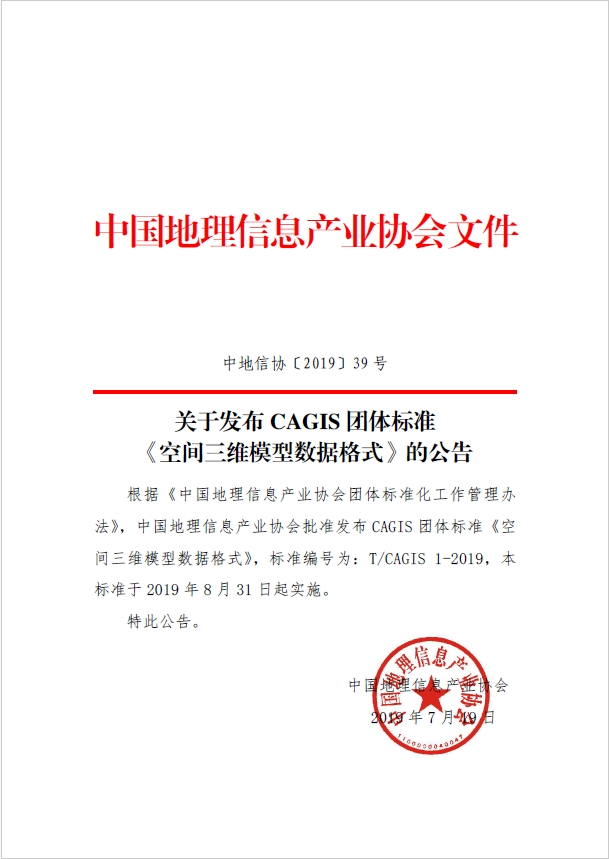
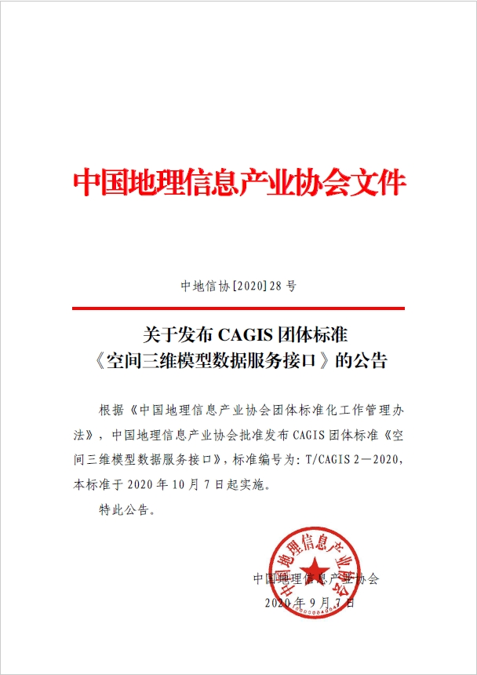
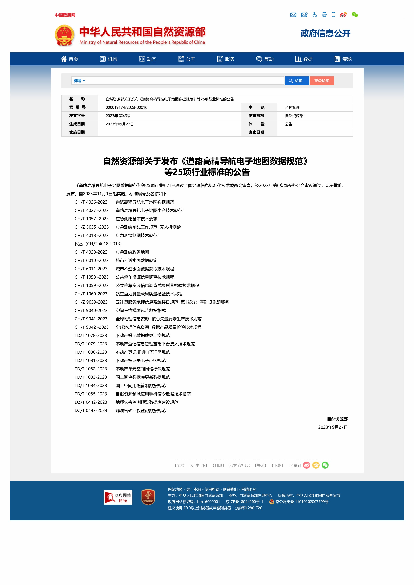

## S3M版本变更情况
- S3M最初是由超图于2015年提出的一个内部闭源格式
- 经过深入的需求调研和应用单位反复验证后，超图于2017年对外发布了S3M 1.0
- 随后经不断创新和拓展，超图于2021年对外发布了S3M 2.0，全面支持PBR（基于物理渲染）材质，提升数据传输性能和渲染质量
- 在结合了最新的IT技术和用户需求后，超图于2022年对外发布了S3M 3.0，支持高性能、高真实感的渲染，并具备属性和语义的扩展能力
- 为符合行标规定并结合业务需求，超图于2024年对外发布了S3M 3.01，提供更高效的属性查询、数据调度、数据局部更新、多要素按需请求能力

## 标准发布情况
### 开源发布
2017年，超图不仅伴随超图产品体系对外发布了S3M 1.0，还在GitHub上开源了S3M 1.0，旨在为三维GIS应用提供一款开放的三维空间数据格式，支持海量异构三维空间数据在各类应用端（桌面电脑和移动设备等），尤其是Web3D客户端的高效应用，从而为多源三维空间数据的共享和互操作提供支撑。

### 团标发布
2019年，空间三维模型数据格式被中国地理信息产业协会采纳为团体标准：T/CAGIS 1—2019《空间三维模型数据格式》，并于同年8月31日正式实施，为不同应用系统之间的空间三维数据共享和互操作提供了开放、标准、通用的数据格式规范。

《空间三维模型数据格式》是中国地理信息产业协会发布的第一个团体标准。该标准由中国地理信息产业协会提出，自然资源部信息中心、国家基础地理信息中心、北京超图软件股份有限公司、中国城市规划设计研究院、中国建筑科学研究院有限公司等12家单位共同起草，并通过了以中国工程院院士刘先林为组长的标准审查组评审，专家组一致认为：该标准具有先进性和适用性，对于推动我国三维地理空间数据的共享及深入应用具有重要作用。

[《空间三维模型数据格式》](./Specification/T／CAGIS%201-2019/)团体标准定义了一种开放式可扩展的空间三维模型数据格式（对应超图发布的S3M 1.0版本），对倾斜摄影三维模型、人工建模数据、BIM、点云、三维管线、二维/三维点线面等各类数据进行整合，适用于海量、多源异构三维地理空间数据和Web环境下的传输与解析，为多源三维地理空间数据在不同终端（移动设备、浏览器、桌面电脑）地理信息平台中的存储、高效绘制、共享与互操作等问题提供了解决方案。并且，标准编制单位已基于本标准形成了完整的B/S及C/S架构的三维GIS应用解决方案，从数据生成、服务器端发布到多种客户端加载应用等多个环节解决用户实际问题。

《空间三维模型数据格式》团体标准的发布，为不同应用系统之间的三维数据共享和互操作提供了开放、标准、通用的数据格式基础，推动了倾斜摄影建模、激光点云、BIM等多源异构的三维数据融合，并兼容多种软硬件环境，为实景三维中国和新型智慧城市建设贡献力量，大力推动了我国三维地理空间数据资产安全可控、开放与共享的建设进程。

此外，2020年9月7日，经中国地理信息产业协会审查批准，《空间三维模型数据服务接口》团体标准发布，并于10月7日起正式实施。该标准是T/CAGIS 1-2019的配套标准，适用于多源异构数据的网络发布与访问，支持应用系统之间的互联互访互操作。

### 行标发布

为进一步提升数据格式服务三维GIS行业的能力、适用于更广泛的应用，并结合最新的三维技术，基于已有的技术基础，相关单位进行了行业标准《空间三维模型瓦片数据格式》(CH/T 9040-2023)（下称“本标准）的编制工作，并基于本标准形成了完整的B/S及C/S架构的三维GIS应用解决方案，可从数据生成、服务发布到多种客户端加载应用等多个环节解决用户实际问题。

自2020年9月11日标准正式立项以来，标准编制单位基于国内三维GIS技术和平台软件的优势，经过草案阶段、征求意见阶段、审查阶段和报批阶段等工作流程，最终顺利完成了标准的编制。在通过全国地理信息标准化技术委员会审查，经2023年第6次自然资源部部长办公会审议通过，本标准于2023年9月27日被批准发布，自2023年11月1日起实施。

