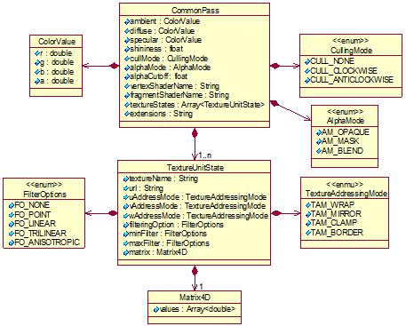
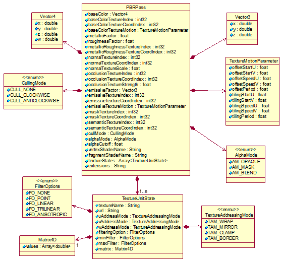

# 材质对象
材质（Material）是模型表面各可视化属性的集合,应采用JSON格式表述。Material对象由渲染通道（Pass）构成，Pass对象可记录材质采用的纹理对象的名称。根据材质类型，Pass对象分为[CommonPass对象](#普通材质对象)和[PBRPass对象](#pbr材质对象)。

按照本页面规范生成的材质内容见[材质内容示例](../../Examples/example_texture.md)。

## Material对象各标签含义

|标签名|类型|描述|
|:---:|:---:|:---|
|name|String|材质的名称|
|type|String|材质类型 取值范围：{‘common’, ‘PBR’}  分别对应：普通材质、PBR材质|
|pass|Variant|渲染通道，用[CommonPass对象](#commonpass对象各标签含义)或[PBRPass对象](#pbr材质对象各标签含义)表示|

## 普通材质对象
普通材质（CommonPass）对象可定义色彩、纹理、透明度、反射率、折射率、发光度等可视化属性。CommonPassPass对象的UML图见下图。

### CommonPass对象各标签含义

|标签名|类型|描述|
|:---:|:---:|:---|
|ambient|ColorValue|环境光颜色,用颜色值[ColorValue对象](#colorvalue对象各标签含义)表示|
|diffuse|ColorValue|散射光颜色，用颜色值[ColorValue对象](#colorvalue对象各标签含义)表示|
|specular|ColorValue|镜面光颜色，用颜色值[ColorValue对象](#colorvalue对象各标签含义)表示|
|shininess|float|光泽度，影响反射光的高光部分的强度|
|cullMode|CullingMode|裁剪模式，用[CullingMode对象](#cullingmode对象各枚举值含义)表示|
|alphaMode|AlphaMode|透明模式，用[AlphaMode对象](#alphamode对象各枚举值含义)表示|
|alphaCutoff|float|透明度过滤阈值，用于判断材质是否渲染 当AlphaMode为AM_MASK时，该阈值与片元着色器a计算的alpha值进行比较，小于该阈值的alpha值所对应的材质不渲染|
|vertexShaderName|String|顶点着色器a名称|
|fragmentShaderName|String|片元着色器a名称|
|textureStates|Array\<TextureUnitState>|材质采用的纹理的信息，用[TextureUnitState对象](#textureunitstate对象各标签含义)构成的数组表示|
|extensions|String|自定义扩展材质的信息|

> a	着色器程序以及源代码，依据具体的运行环境而自行配置。

### ColorValue对象各标签含义

|标签名|类型|描述|
|:---:|:---:|:---|
|r|double|红色分量值，取值范围0.0到1.0|
|g|double|绿色分量值，取值范围0.0到1.0|
|b|double|蓝色分量值，取值范围0.0到1.0|
|a|double|透明度分量值，取值范围0.0到1.0|

### CullingMode对象各枚举值含义

|枚举名|类型|描述|
|:---:|:---:|:---|
|CULL_NONE|int32|无裁剪模式|
|CULL_CLOCKWISE|int32|顺时针裁剪模式|
|CULL_ANTICLOCKWISE|int32|逆时针裁剪模式|

### AlphaMode对象各枚举值含义

|枚举名|类型|描述|
|:---:|:---:|:---|
|AM_OPAQUE|int32|完全不透明|
|AM_MASK|int32|遮罩模式，用于选择性控制可见的对象|
|AM_BLEND|int32|混合模式 |

### TextureUnitState对象各标签含义

|标签名|类型|描述|
|:---:|:---:|:---|
|textureName|String|纹理名字|
|url|String|纹理引用路径，可以是绝对路径、网络路径或相对路径。如果采用相对路径，则为相对于描述文件所在位置的路径|
|uAddressMode|TextureAddressingMode|纹理坐标u方向上纹理坐标寻址模式，用纹理处理模式[TextureAddressingMode对象](#textureaddressingmode对象各枚举值含义)表示|
|vAddressMode|TextureAddressingMode|纹理坐标v方向上纹理坐标寻址模式，用纹理处理模式[TextureAddressingMode对象](#textureaddressingmode对象各枚举值含义)表示|
|wAddressMode|TextureAddressingMode|纹理坐标w方向上纹理坐标寻址模式，用纹理处理模式[TextureAddressingMode对象](#textureaddressingmode对象各枚举值含义)表示|
|filteringOption|FilterOptions|纹理插值模式,用[FilterOptions对象](#filteroptions对象各枚举值含义)表示|
|minFilter|FilterOptions|纹理缩小时采用的插值模式，用[FilterOptions对象](#filteroptions对象各枚举值含义)表示|
|maxFilter|FilterOptions|纹理放大时采用的插值模式，用[FilterOptions对象](#filteroptions对象各枚举值含义)表示|
|matrix|Matrix4D|纹理缩放矩阵，用[Matrix4D对象](./S3MB.md#matrix4d对象各属性含义)表示|

### TextureAddressingMode对象各枚举值含义

|枚举名|类型|描述|
|:---:|:---:|:---|
|TAM_WRAP|int32|重复贴图|
|TAM_MIRROR|int32|对称翻转|
|TAM_CLAMP|int32|边缘像素来填充所有大于1的纹理坐标，边缘拉长|
|TAM_BORDER|int32|边框像素来填充所有大于1的纹理坐标，边框拉长|

### FilterOptions对象各枚举值含义

|枚举名|类型|描述|
|:---:|:---:|:---|
|FO_NONE|int32|无过滤|
|FO_POINT|int32|邻近取样|
|FO_LINEAR|int32|双线过滤|
|FO_TRILINEAR|int32|三线过滤|
|FO_ANISOTROPIC|int32|各向异性过滤|

## PBR材质对象
PBR材质使用PBRPass对象来描述，不仅可通过相应的纹理对象定义基色、金属度、粗糙度、法线、遮挡、自发光等可视化属性，还可定义掩膜纹理、语义纹理和动画纹理等。PBRPass对象的UML图见下图。

### PBR材质对象各标签含义
|标签名|类型|描述|
|:---:|:---:|:---|
|baseColor|Vector4|基色，即物体的基础颜色，用[Vector4对象](#vector4对象各标签含义)表示|
|baseColorTextureIndex|int32|基色纹理在纹理数组（textureStates）中的序号|
|baseColorTextureCoordIndex|int32|基色纹理的纹理坐标在[纹理坐标数组（textureCoords）](./Skeleton.md#vertexdatapackage对象各属性含义)中的序号|
|baseColorTextureMotion|TextureMotionParameter|基色纹理运动的参数对象，用[TextureMotionParameter对象](#texturemotionparameter对象各标签含义）表示|
|metallicFactor|float|控制金属度强弱的因子|
|roughnessFactor|float|控制粗糙度强弱的因子 |
|metallicRoughnessTextureIndex|int32|金属度和粗糙度纹理在纹理数组（textureStates）中的序号（R通道存储金属度，G通道存储粗糙度）|
|metallicRoughnessTextureCoordIndex|int32|金属度和粗糙度纹理的纹理坐标在[纹理坐标数组（textureCoords）](./Skeleton.md#vertexdatapackage对象各属性含义)中的序号|
|normalTextureIndex|int32|法线纹理在纹理数组（textureStates）中的序号。法线用于表达物体表面的凹凸细节|
|normalTextureCoordIndex|int32|法线纹理的纹理坐标在[纹理坐标数组（textureCoords）](./Skeleton.md#vertexdatapackage对象各属性含义)中的序号|
|normalTextureScale|float|法线纹理缩放因子|
|occlusionTextureIndex|int32|遮挡纹理在纹理数组（textureStates）中的序号。遮挡用于表达物体表面凹凸性对光照的影响|
|occlusionTextureCoordIndex|int32|遮挡纹理的纹理坐标在[纹理坐标数组（textureCoords）](./Skeleton.md#vertexdatapackage对象各属性含义)）中的序号|
|occlusionTextureStrength|float|遮挡纹理的强度因子|
|emissiveFactor|Vector3|自发光强度因子,用[Vector3对象](#vector3对象各标签含义)表示|
|emissiveTextureIndex|int32|自发光纹理在纹理数组（textureStates）中的序号|
|emissiveTextureCoordIndex|int32|自发光纹理的纹理坐标在[纹理坐标数组（textureCoords）](./Skeleton.md#vertexdatapackage对象各属性含义)中的序号|
|emissiveTextureMotion|TextureMotionParameter|自发光纹理运动的参数对象，用[TextureMotionParameter对象](#texturemotionparameter对象各标签含义)表示|
|maskTextureIndex|int32|掩膜纹理在纹理数组（textureStates）中的序号|
|maskTextureCoordIndex|int32|掩膜纹理的纹理坐标在[纹理坐标数组（textureCoords）](./Skeleton.md#vertexdatapackage对象各属性含义)的序号|
|semanticTextureIndex|int32|语义纹理在纹理数组（textureStates）中的序号|
|semanticTextureCoordIndex|int32|语义纹理的纹理坐标在[纹理坐标数组（textureCoords）](./Skeleton.md#vertexdatapackage对象各属性含义)中的序号|
|cullMode|CullingMode|裁剪模式，用[CullingMode对象](#cullingmode对象各枚举值含义)表示|
|alphaMode|AlphaMode|透明模式，用[AlphaMode对象](#alphamode对象各枚举值含义)表示|
|alphaCutoff|float|透明度过滤阈值，用于判断材质是否渲染 当AlphaMode为AM_MASK时，该阈值与baseColor的w值进行比较，小于该阈值的w值所对应的baseColor渲染为完全透明，否则baseColor渲染为完全不透明 其他透明模式下，该阈值不起作用|
|vertexShaderName|String|顶点着色器a名称|
|fragmentShaderName|String|片元着色器a名称|
|textureStates|Array<TextureUnitState>|材质采用的纹理的信息，用[TextureUnitState对象](#textureunitstate对象各标签含义)构成的数组表示|
|extensions|String|自定义扩展材质的信息|

> a 着色器程序以及源代码，依据具体的运行环境而自行配置。

### Vector4对象各标签含义

|标签名|类型|描述|
|:---:|:---:|:---|
|x|double|向量的x分量|
|y|double|向量的y分量|
|z|double|向量的z分量|
|w|double|向量的w分量|

### TextureMotionParameter对象各标签含义

|标签名|类型|描述|
|:---:|:---:|:---|
|offsetStartU|float|纹理平移运动过程中纹理坐标U方向的起始位置|
|offsetStartV|float|纹理平移运动过程中纹理坐标V方向的起始位置|
|offsetSpeedU|float|纹理平移运动过程中纹理坐标U方向的速度|
|offsetSpeedV|float|纹理平移运动过程中纹理坐标V方向的速度|
|offsetPeriod|float|纹理平移运动周期，单位是秒|
|tilingStartU|float|纹理缩放运动过程中纹理坐标U方向的起始位置|
|tilingStartV|float|纹理缩放运动过程中纹理坐标V方向的起始位置|
|tilingSpeedU|float|纹理缩放运动过程中纹理坐标U方向的速度|
|tilingSpeedV|float|纹理缩放运动过程中纹理坐标V方向的速度|
|tilingPeriod|float|纹理缩放运动周期，单位是秒|

### Vector3对象各标签含义

|标签名|类型|描述|
|:---:|:---:|:---|
|x|double|向量的x分量|
|y|double|向量的y分量|
|z|double|向量的z分量|