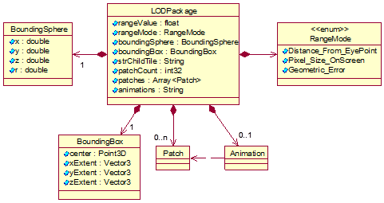
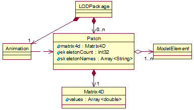
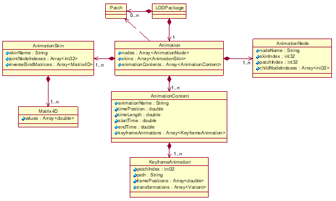
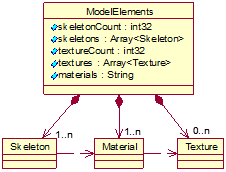
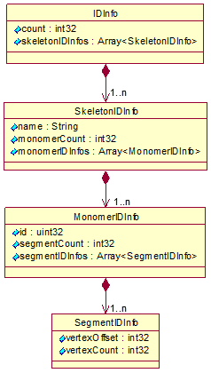
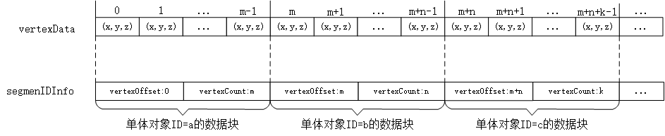
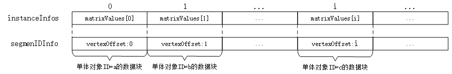

# 数据文件存储格式
本页面说明了数据文件(*.s3mb)的存储形式及具体内容。

数据文件（Tile对象）是数据的主要组成部分，主要由[LODPackage](#细节层次数据包对象)、[ModelElements](#模型元素对象)、[IDInfo](#idinfo对象)和[Extensions](#扩展对象)四个对象构成。

数据文件采用[二进制流形式存储](./S3MBBinary.md)。

## 细节层次数据包对象

细节层次数据包（LODPackage）是细节层次切换的最小数据单元，应包括LOD切换模式、数据范围、挂接的子文件路径、数据片（Patch）等数据信息，可包含动画（Animation）信息。LODPackage对象的UML图见下图。

### LODPackage对象各属性含义

|属性名|类型|描述|
|:---:|:---:|:---|
|rangeValue|float|LOD切换的阈值因子，与LOD切换模式配合使用|
|rangeMode|RangeMode|LOD切换模式，即LOD切换过程中基于该模式选取一个合适的LOD，用[RangeMode对象](#rangemode对象各枚举值含义)表示|
|boundingSphere|BoundingSphere|包围球，用[BoundingSphere对象](#boundingsphere对象各属性含义)表示|
|boundingBox|BoundingBox|包围盒，用[BoundingBox对象](../scp.json.md#boundingbox对象各标签含义)表示|
|strChildTile|String|挂接的下一层级的数据文件相对于当前文件的路径|
|patchCount|int32|数据片的个数|
|patches|Array\<Patch>|数据片集合，用[Patch对象](#数据片对象)构成的数组表示|
|animations|String|动画字符串（JSON格式）,用[Animation对象](#animation对象各标签含义)表示|

### RangeMode对象各枚举值含义

|枚举名|类型|描述|
|:---:|:---:|:---|
|Distance_From_EyePoint|int32|基于距离的LOD选取，距离通常是指瓦片与视点之间的距离|
|Pixel_Size_OnScreen|int32|基于投影面积的LOD选取，投影面积通常是指瓦片投影在屏幕上的像素数|
|Geometric_Error|int32|基于几何误差模式的LOD选取|

### BoundingSphere对象各属性含义

|属性名|类型|描述|
|:---:|:---:|:---|
|x|double|包围球中心点的x坐标值|
|y|double|包围球中心点的y坐标值|
|z|double|包围球中心点的z坐标值|
|r|double|包围球半径|

### 数据片对象
数据片（Patch）是构成[LODPackage](#细节层次数据包对象)数据组成单元。Patch与[模型元素（ModelElement）](#modelelements对象各属性含义)存在聚合关系。Patch对象的UML图见下图。

#### Patch对象各属性含义

|属性名|类型|描述|
|:---:|:---:|:---|
|matrix4d|Matrix4D|作用于骨架姿态的矩阵，应符合右手笛卡尔坐标系，用[Matrix4D对象](#matrix4d对象各属性含义)表示|
|skeletonCount|int32|Patch中骨架对象的数量|
|skeletonNames|Array\<String>|Patch中骨架名字数组。骨架名字与ModelElments中的骨架名对应。当[Config对象](../scp.json.md#config对象各标签含义)中dataType取值为InstanceModel时，该属性含义为外挂模型路径的数组|

#### Matrix4D对象各属性含义

|属性名|类型|描述|
|:---:|:---:|:---|
|values|Array\<double>|4×4矩阵，16个double值表示，行主序|

### 动画对象

动画（Animation）对象用于描述[LODPackage](#lodpackage对象各属性含义)中[Patch数据](#patch对象各属性含义)的动画展示过程，可表达节点动画和骨骼动画。在节点动画中，通过平移、旋转模型来生成动画。在骨骼动画中，模型具有互相连接的“骨骼”组成的骨架结构，通过改变骨骼的朝向和位置来为模型生成动画。

Animation对象应采用JSON格式表述，包括[动画节点（AnimationNode）对象](#animationnode对象各标签含义)、[动画蒙皮（AnimationSkin）对象](#animationskin对象各标签含义)以及[动画内容（AnimationContent）对象](#animationcontent对象各标签含义)。Animation对象的UML图见下图。

[AnimationSkin对象](#animationskin对象各标签含义)记录关节信息，与[AnimationNode对象](#animationnode对象各标签含义)中记录的指定Patch中的蒙皮信息，共同确定骨骼动画的初始状态。[AnimationContent对象](#animationcontent对象各标签含义)控制动画的帧状态及动作时长等。

蒙皮包括权重和关节两部分数据，存储在[顶点扩展属性extension对象](./Skeleton.md#vertexattributeextension对象各属性含义)中。[蒙皮权重（SkinnedWeight_0）对象](#skinnedweight_0对象各属性含义)包含指示关节对顶点的影响强度的权重。[蒙皮关节（SkinnedJoint_0）对象](#skinnedjoint_0对象各属性含义)包含影响顶点的关节的索引。

#### Animation对象各标签含义

|标签名|类型|描述|
|:---:|:---:|:---|
|nodes|Array\<AnimationNode>|动画节点信息集合，用[AnimationNode对象](#animationnode对象各标签含义)构成的数组表示|
|skins|Array\<AnimationSkin>|动画蒙皮信息集合，用[AnimationSkin对象](#animationskin对象各标签含义)构成的数组表示|
|animationContents|Array\<AnimationContent>|动画内容信息集合，用[AnimationContent对象](#animationcontent对象各标签含义)构成的数组表示|

#### AnimationNode对象各标签含义

|标签名|类型|描述|
|:---:|:---:|:---|
|nodeName|String|动画节点名称|
|skinIndex|int32|使用的AnimationSkin在[skins数组](#animation对象各标签含义)中的索引号|
|patchIndex|int32|使用的Patch在[LODPackage](#lodpackage对象各属性含义)里patches中的索引号|
|childNodeIndexes|Array\<int32>|子节点在[nodes数组](#animation对象各标签含义)中的索引号构成的数组|

#### AnimationSkin对象各标签含义

|标签名|类型|描述|
|:---:|:---:|:---|
|skinName|String|蒙皮名称|
|jointNodeIndexes|Array\<int32>|骨骼动画关节的节点的索引号数组，由节点在[nodes数组](#animation对象各标签含义)中的索引号构成|
|inverseBindMatrices|Array<Matrix4D>|作用于关节的逆矩阵数组，用[Matrix4D对象](#matrix4d对象各属性含义)构成的数组表示，数组长度与jointNodeIndexes的数组长度相同|

#### AnimationContent对象各标签含义

|标签名|类型|描述|
|:---:|:---:|:---|
|animationName|String|动画名称|
|timePosition|double|当前动画所处的时间位置|
|[timeLength](#动画时长说明)|double|总动画时间的长度，单位为秒|
|startTime|double|起始时间|
|endTime|double|结束时间|
|keyframeAnimations|Array\<KeyframeAnimation>|关键帧动画数据集合，用[KeyframeAnimation对象](#keyframeanimation对象各标签含义)构成的数组表示|

#### KeyframeAnimation对象各标签含义

|标签名|类型|描述|
|:---:|:---:|:---|
|patchIndex|int32|使用的Patch在LODPackage里patches中的索引号|
|path|String|变换类型 取值范围：{‘scale’,‘rotation’,‘translation’ ,‘weights’ } 分别对应：缩放、旋转、平移、权重|
|framePositions|Array\<double>|指定的动画的帧在总动画时间中的位置构成的数组|
|transformations|Array\<Variant>|变换数值构成的数组 当变换类型为缩放或平移时，Variant类型为[Vector3](./Material.md#vector3对象各标签含义) 当变换类型为旋转时，Variant类型为[Vector4](./Material.md#vector4对象各标签含义) 当变换类型为权重时，Variant类型为double|

#### SkinnedWeight_0对象各属性含义

|属性名|类型|描述|
|:---:|:---:|:---|
|count|uint32|影响的顶点的数量|
|dimension|uint16|影响一个顶点的关节数量，默认为4|
|vertexAttributetype|[VertexAttributeType](./Skeleton.md#vertexattributetype对象各枚举含义)|蒙皮权重的数据类型，取值为AT_FLOAT|
|data|Array\<float>|蒙皮权重数组，数组长度为count*dimension|

#### SkinnedJoint_0对象各属性含义

|属性名|类型|描述|
|:---:|:---:|:---|
|count|uint32|影响的顶点的数量|
|dimension|uint16|影响一个顶点的关节数量，默认为4|
|vertexAttributetype|[VertexAttributeType](./Skeleton.md#vertexattributetype对象各枚举含义)|蒙皮关节的数据类型,取值为AT_16BIT|
|data|Array\<uint16>|蒙皮关节数组，数组长度为count*dimension|

#### 动画时长说明

一个动画的总时长由timeLength确定，timePosition记录当前动画所处的时间位置，startTime规定开始执行动画的时间，endTime规定结束执行动画的时间，framePositions规定关键帧动画中指定动画的时间，示例见下图。

> 注1：timePosition=3.0，代表当前动画所处时间为第3秒；timeLength=8.0，代表动画总时长为8秒。 注2：translation（平移）的framePositions数组为[0.0，1.0，2.0，3.0，4.0]。 注3：scale（缩放）的framePositions数组为[4.0，5.0，6.0，7.0，8.0]。

## 模型元素对象

ModelElements对象记录一个Tile中所有的模型元素信息，主要包括[骨架（Skeleton）对象](#骨架对象)、[材质（Material）对象](#材质对象)以及[纹理（Texture）对象](#纹理对象)。ModelElements对象的UML图见下图。

### ModelElements对象各属性含义

|属性名|类型|描述|
|:---:|:---:|:---|
|skeletonCount|int32|Tile中骨架对象的数量|
|skeletons|Array\<Skeleton>|Tile中骨架对象集合，用[Skeleton对象](#骨架对象)构成的数组表示|
|textureCount|int32|Tile中纹理对象的数量|
|textures|Array\<Texture>|Tile中纹理对象集合，用[Texture对象](#纹理对象)构成的数组表示|
|materials|String|Tile中材质对象字符串（JSON格式）,用多个[Material对象](#材质对象)表示|

### [骨架对象](./Skeleton.md)

骨架（Skeleton）是三维模型的几何结构特征信息。Skeleton对象()由[顶点数据包（VertexDataPackage）](./Skeleton.md#vertexdatapackage对象各属性含义)和[顶点索引包（IndexPackage）](./Skeleton.md#indexpackage对象各属性含义)等构成。[VertexDataPackage对象](./Skeleton.md#vertexdatapackage对象各属性含义)应包括坐标、法线、颜色、纹理坐标等，可包含[实例化信息集合（InstanceInfos）](./Skeleton.md#instanceinfo对象各属性含义)。[IndexPackage对象](./Skeleton.md#indexpackage对象各属性含义)用于定义骨架结构构造，每个IndexPackage对象对应一个或多个材质，用来标识该组顶点的渲染方式。

根据压缩类型，Skeleton对象分为[无压缩的Skeleton对象](./Skeleton.md#无压缩的骨架对象)和[采用几何压缩技术的Skeleton对象](./Skeleton.md#采用几何压缩技术的骨架对象)。

### [材质对象](./Material.md)
材质（Material）是模型表面各可视化属性的集合,应采用JSON格式表述。Material对象由渲染通道（Pass）构成，Pass对象可记录材质采用的纹理对象的名称。

根据材质类型，Pass对象分为[CommonPass对象](./Material.md#commonpass对象各标签含义)和[PBRPass对象](./Material.md#pbr材质对象)。

### [纹理对象](./Texture.md)

纹理（Texture）是用于改变物体表面外观纹理贴图信息，包含宽、高、压缩方式及纹理二进制数据等。

## IDInfo对象

IDInfo对象，即模型ID信息，用于标识Tile中的单体对象。单体对象是指一个可以被单独管理、被选中分离的对象。IDInfo对象可采用二进制或JSON格式表述，对象的UML图见下图。

### IDInfo对象各属性含义
|属性名|类型|描述|
|:---:|:---:|:---|
|count|int32|Tile中骨架的数量|
|skeletonIDInfos|Array\<SkeletonIDInfo>|Tile中骨架ID信息集合，用[SkeletonIDInfo对象](#skeletonidinfo对象各属性含义)构成的数组表示|

### SkeletonIDInfo对象各属性含义
|属性名|类型|描述|
|:---:|:---:|:---|
|name|String|骨架的名称|
|monomerCount|int32|骨架中单体对象的数量|
|monomerIDInfos|Array\<MonomerIDInfo>|骨架中单体对象ID信息集合，用[MonomerIDInfo对象](#monomeridinfo对象各属性含义)构成的数组表示|

### MonomerIDInfo对象各属性含义

|属性名|类型|描述|
|:---:|:---:|:---|
|id|uint32|单体对象ID|
|segmentCount|int32|单体对象包含的数据块数量|
|segmentIDInfos|Array\<SegmentIDInfo>|数据块ID信息集合，用[SegmentIDInfo对象](#segmentidinfo对象各属性含义)构成的数组表示|

### SegmentIDInfo对象各属性含义
|属性名|类型|描述|
|:---:|:---:|:---|
|vertexOffset|int32|该属性值含义为： a）	非实例化数据中表示顶点偏移量，即顶点坐标在顶点坐标数组中的偏移量，是单体对象在骨架顶点坐标值数组中的起始位置； b）	实例化数据中表示，单体对象在实例化信息集合instanceInfos中的索引位置。|
|vertexCount|int32|该属性值含义为： a）	非实例化对象中表示顶点数量； b）	实例化对象中存储固定值0|

### 非实例化数据存储说明

非实例化数据中每个数据块（Segment）的坐标对应骨架顶点坐标值数组（vertexData）中的某个部分，该部分的位置由顶点起始位置（vertexOffset）和顶点数量（vertexCount）两个属性值确定，见下图。

### 实例化数据存储说明
实例化数据中每个Segment对应实例化信息数组（instanceInfos）中的某个实例，该实例的位置由索引位置（vertexOffset）确定，见下图。

## 扩展对象
扩展（Extensions）对象，可用于记录数据自定义扩展信息，应采用JSON格式表述。

### Extensions对象各标签含义
|标签名|类型|描述|
|:---:|:---:|:---|
|extensions|String|数据扩展信息|

