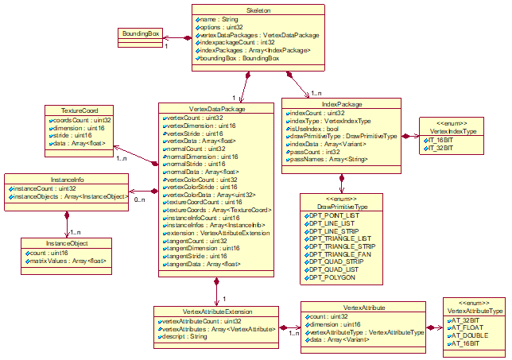

# 骨架对象
根据压缩类型，骨架(Skeleton)对象分为[无压缩的Skeleton对象](#无压缩的骨架对象)和采用[几何压缩技术的Skeleton对象](#采用几何压缩技术的骨架对象)。

## 无压缩的骨架对象
无压缩的Skeleton对象的UML图见下图。



二进制存储流形式见[ModelElements的二进制流描述](./S3MBBinary.md#modelelements的二进制流描述)。

### 无压缩的Skeleton对象各属性含义

|属性名|类型|描述|
|:---:|:---:|:---|
|name|String|骨架对象的名称|
|options|uint32|骨架对象是否压缩的标识信息，取值为0时，表示不压缩，取值为1时，表示压缩|
|vertexDataPackages|VertexDataPackage|骨架的顶点数据包，用[VertexDataPackage对象](#vertexdatapackage对象各属性含义)表示|
|indexpackageCount|int32|骨架中顶点索引包的数量|
|indexPackages|Array\<IndexPackage>|骨架中顶点索引数据包集合，用[IndexPackage对象](#indexpackage对象各属性含义)构成的数组表示|
|boundingBox|BoundingBox|包围盒，用[BoundingBox对象](../scp.json.md#boundingbox对象各标签含义)表示|

### VertexDataPackage对象各属性含义

|属性名|类型|描述|
|:---:|:---:|:---|
|vertexCount|uint32|顶点的数量|
|vertexDimension|uint16|顶点维度|
|vertexStride|uint16|顶点坐标值数组（vertexData）中单个顶点的所有元素所占的字节总数。如果顶点维度为3，则该值为3*4<sup>\*</sup>=12|
|vertexData|Array\<float>|顶点坐标值数组|
|normalCount|uint32|法线的数量|
|normalDimension|uint16|法向量的维度|
|normalStride|uint16|法向量分量值数组（normalData）中单个法向量分量值的所有元素所占的字节总数。如果法向量的维度为3，则该值为3*4<sup>\*</sup>=12|
|normalData|Array\<float>|法向量分量值构成的数组|
|vertexColorCount|uint32|顶点颜色值的数量|
|vertexColorStride|uint16|顶点颜色数组（vertexColorData）中单个顶点颜色的所有元素所占的字节总数，默认为4<sup>*</sup>|
|vertexColorData|Array\<unit32>|顶点颜色数组|
|textureCoordCount|uint16|纹理坐标对象的数量|
|textureCoords|Array\<TextureCoord>|纹理坐标对象集合，用[TextureCoord](#texturecoord对象各属性含义)构成的数组表示|
|instanceInfoCount|uint16|实例化信息的数量|
|instanceInfos|Array\<InstanceInfo>|实例化信息集合，用[InstanceInfo对象](#instanceinfo对象各属性含义)构成的数组表示|
|extension|VertexAttributeExtension|顶点扩展属性，用[VertexAttributeExtension对象](#vertexattributeextension对象各属性含义)表示|
|tangentCount|uint32|切线的数量|
|tangentDimension|uint16|切向量的维度|
|tangentStride|uint16|切向量分量值数组（tangentData）中单个切向量的所有元素所占的字节总数。如果切向量的维度为3，则该值为3*4<sup>\*</sup>=12|
|tangentData|Array\<float>|切向量分量值构成的数组|

><sup>*</sup> 元素所在数组为float数组或uint32数组，一个float值/uint32值具有4个字节，因此一个元素占4个字节。

### TextureCoord对象各属性含义

|属性名|类型|描述|
|:---:|:---:|:---|
|coordsCount|uint32|纹理坐标的数量|
|dimension|uint16|纹理坐标维度|
|stride|uint16|纹理坐标值数组（data）中单个纹理坐标的所有元素所占的字节总数。data数组是float数组，因此一个元素占4个字节，如果纹理坐标维度为2，则该值为2*4=8|
|data|Array\<float>|纹理坐标值数组|

### InstanceInfo对象各属性含义

|属性名|类型|描述|
|:---:|:---:|:---|
|instanceCount|uint32|实例化对象的数量|
|instanceObjects|Array\<InstanceObject>|实例化对象集合，用[InstanceObject对象](#instanceobject对象各属性含义)构成的数组表示|

### InstanceObject对象各属性含义

|属性名|类型|描述|
|:---:|:---:|:---|
|count|uint16|实例化对象变换矩阵值的数量。<br>取值范围：{‘16’}|
|matrixValues|Array\<float>|4×4实例化对象变换矩阵|


### VertexAttributeExtension对象各属性含义

|属性名|类型|描述|
|:---:|:---:|:---|
|vertexAttributeCount|uint32|顶点扩展属性数组的数量|
|vertexAttributes|Array\<VertexAttribute>|顶点扩展属性数组集合， 用[VertexAttribute对象](#vertexattribute对象各属性含义)构成的数组表示|
|descript|String|顶点扩展属性数组的语义描述信息，采用JSON格式表述|

### VertexAttribute对象各属性含义

|属性名|类型|描述|
|:---:|:---:|:---|
|count|uint32|顶点属性的数量|
|dimension|uint16|顶点属性的维度|
|vertexAttributetype|VertexAttributeType|顶点属性的数据类型,用[VertexAttributeType对象](#vertexattributetype对象各枚举含义)表示|
|data|Array\<Variant >|顶点属性数组，根据顶点属性的数据类型，可以是Interger数组、Float数组或Double数组|

### VertexAttributeType对象各枚举含义

|枚举名|类型|描述|
|:---:|:---:|:---|
|AT_32BIT|int32|32位无符号整型|
|AT_FLOAT|int32|单精度浮点型|
|AT_DOUBLE|int32|双精度浮点型|
|AT_16BIT|int32|16位无符号短整型|

### IndexPackage对象各属性含义

|属性名|类型|描述|
|:---:|:---:|:---|
|indexCount|uint32|顶点索引个数|
|indexType|VertexIndexType|顶点索引类型，用[VertexIndexType对象](#vertexindextype对象各枚举值含义)表示|
|isUseIndex|bool|是否使用索引|
|drawPrimitiveType|DrawPrimitiveType|图元类型，用[DrawPrimitiveType对象](#drawprimitivetype对象各枚举值含义)表示|
|indexData|Array\<Variant>|顶点索引值数据，根据顶点索引类型，可以是Short数组或Integer数组|
|passCount|int32|渲染该对象时使用的Pass对象的数量|
|passNames|Array\<String>|渲染该对象时使用的Pass对象的名称|

### VertexIndexType对象各枚举值含义

|枚举名|类型|描述|
|:---:|:---:|:---|
|IT_16BIT|int32|16位无符号整型|
|IT_32BIT|int32|32位无符号整型|

> 注：一般根据顶点的个数选择顶点索引类型，顶点的个数大于65535则采用IT_32BIT，否则采用IT_16BIT。

### DrawPrimitiveType对象各枚举值含义

|枚举名|类型|描述|
|:---:|:---:|:---|
|DPT_POINT_LIST|int32|点|
|DPT_LINE_LIST|int32|线|
|DPT_LINE_STRIP|int32|条带线|
|DPT_TRIANGLE_LIST|int32|独立三角形|
|DPT_TRIANGLE_STRIP|int32|三角形条带|
|DPT_TRIANGLE_FAN|int32|三角形扇面|
|DPT_QUAD_STRIP|int32|四边形条带|
|DPT_QUAD_LIST|int32|四边形串，不共享边|
|DPT_POLYGON|int32|多边形|

## 采用几何压缩技术的骨架对象

### 存储结构
#### 采用几何压缩技术的Skeleton对象各属性含义
|属性名|类型|描述|
|:---:|:---:|:---|
|name|String|骨架对象的名称|
|options|uint32|骨架对象是否压缩的标识信息，取值为0时，表示不压缩；取值为1时，表示压缩|
|compressedDataPackage|CompressedDataPackage|压缩数据包，用CompressedDataPackage对象表示|
|boundingBox|BoundingBox|包围盒，用[BoundingBox对象](../scp.json.md#boundingbox对象各标签含义)表示|

#### CompressedDataPackage对象各属性含义

|属性名|类型|描述|
|:---:|:---:|:---|
|compressedOptions|int32|压缩信息|
|positionInfoID|int32|顶点位置属性的ID|
|normalInfoID|int32|顶点法线属性的ID|
|colorInfoID|int32|顶点颜色属性的ID|
|textureCoordCount|uint32|多重纹理的数量|
|textureCoordInfoIDs|Array\<int32>|顶点纹理坐标属性的ID构成的数组|
|vertexAttributeCount|uint32|顶点属性对象的数量|
|vertexAttributeInfoIDs|Array\<int32>|顶点属性的ID构成的数组|
|indexCount|uint32|顶点索引数量|
|passNames|Array\<String>|渲染该对象时使用的Pass对象名称|
|compressedSize|uint32|压缩后的字节大小|
|compressedData|Array\<char>|压缩后的顶点数据和顶点索引数据|
|descript|String|顶点扩展属性数组的语义描述信息，采用JSON格式表述|

### 二进制流描述
采用几何压缩技术的Skeleton对象存储在数据文件中，是[ModelElements](./S3MB.md#模型元素对象)的属性之一。除Skeleton对象外，ModelElements及其他相关对象的二进制流结构应符合[相关规定](./S3MBBinary.md#modelelements的二进制流描述)。

采用几何压缩技术的Skeleton及相关对象的二进制流结构应符合如下规定：

```
Skeleton{
    uint32
    skeletonStreamSize;   //骨架对象的二进制长度，以Byte为单位
    String name;               //骨架对象的名称
    byte reserved[n];					 //补齐四字节，n取值为0～3
    uint32 options;				   //骨架对象是否压缩的标识信息，取值为0时，表示不压缩，取值为1时，表示压缩
    CompressedDataPackag compressedDataPackage;   //压缩数据包
    BoundingBox boundingBox;         //包围盒
}
CompressedDataPackage{
    uint32 dataPackageStreamSize;   //数据流的二进制长度，以byte为单位
    int32 compressedOptions;        //压缩信息
    int32 positionInfoID;           //顶点位置属性的ID
    int32     normalInfoID;             //顶点法线属性的ID
    int32 colorInfoID;              //顶点颜色属性的ID
    uint32 textureCoordCount;       //多重纹理的数量
    int32 textureCoordInfoIDs[textureCoordCount];    //顶点纹理坐标属性的ID构成的数组
    uint32 vertexAttributeCount;//顶点属性数组的数量
    int32 vertexAttributeInfoIDs[vertexAttributeCount];  //顶点属性的ID构成的数组
    uint32 indexCount;//顶点索引数量
    String passNames[indexCount];          //渲染该对象时使用的Pass对象名称
    byte reserved[n];					     //补齐四字节，n取值为0～3
    uint32 compressedSize;                 //压缩后的字节大小
    char compressedData[compressedSize];   //压缩后的顶点数据和索引数据
    byte reserved[n];					 //补齐四字节，n取值为0～3
    String descript;	                 //顶点属性数组的语义描述信息，采用JSON格式表述
    byte reserved[n];					 //补齐四字节，n取值为0～3
};
BoundingBox{
    Point3D center;           //包围盒中心点
    Vector3 xExtent;          //包围盒x方向和长度
    Vector3 yExtent;          //包围盒y方向和长度
    Vector3 zExtent;          //包围盒Z方向和长度
};
Point3D{
    double x;              //空间点的x坐标值
    double y;              //空间点的y坐标值
    double z;              //空间点的z坐标值
};
Vector3{
    double x;             //向量的x分量
    double y;             //向量的y分量
    double z;             //向量的z分量
};
```