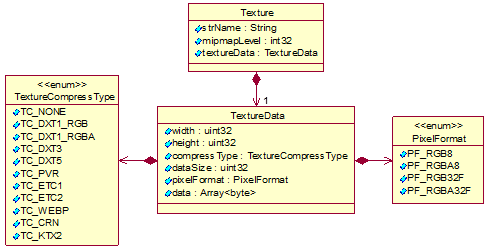

# 纹理对象

纹理（Texture）是用于改变物体表面外观纹理贴图信息，包含宽、高、压缩方式及纹理二进制数据等。Texture对象的UML图见下图。

二进制存储流形式见[ModelElements的二进制流描述](./S3MBBinary.md#modelelements的二进制流描述)。

## Texture对象各属性含义

|属性名|类型|描述|
|:---:|:---:|:---|
|strName|String|纹理对象的名称|
|mipmapLevel|int32|纹理对象包含的贴图层数|
|textureData|TextureData|纹理数据，用[TextureData对象](#texturedata对象各属性含义)表示|

## TextureData对象各属性含义

|属性名|类型|描述|
|:---:|:---:|:---|
|width|uint32|横向像素个数|
|height|uint32|纵向像素个数|
|compressType|TextureCompressType|纹理压缩方式，用[TextureCompressType对象](#texturecompresstype各枚举值含义)表示|
|dataSize|uint32|纹理的二进制流大小|
|pixelFormat|PixelFormat|纹理的像素格式，用[PixelFormat对象](#pixelformat各枚举值含义)表示|
|data|Array<byte>|纹理数据二进制流|

### TextureCompressType各枚举值含义

|枚举名|类型|描述|
|:---:|:---:|:---|
|TC_NONE|int32|无压缩格式|
|TC_DXT1_RGB/TC_DXT1_RGBA/TC_DXT3/TC_DXT5|int32|DXT纹理压缩格式，适用于PC、Web端|
|TC_PVR|int32|PVR纹理压缩格式，适用于iOS端|
|TC_ETC1/TC_ETC2|int32|ETC纹理压缩格式，适用于Andriod端|
|TC_WEBP|int32|WEBP纹理压缩格式|
|TC_CRN|int32|CRN纹理压缩格式|
|TC_KTX2|int32|KTX2.0纹理容器格式，内部为Basis Universal纹理压缩格式|

> 注：如有需求，支持自行扩展设置纹理压缩格式。

### PixelFormat各枚举值含义

|枚举名|类型|描述|
|:---:|:---:|:---|
|PF_RGB8|int32|RGB格式，3字节像素，R、G、B分别占一个字节|
|PF_RGBA8|int32|RGBA格式，4字节像素，R、G、B、A分别占一个字节|
|PF_RGB32F|int32|96位像素，R、G、B分别占32位像素|
|PF_RGBA32F|int32|128位像素，R、G、B、A分别占32位像素|

> 注：不限制像素格式，仅列出几个主要的像素格式，如有需求，支持自行扩展设置。