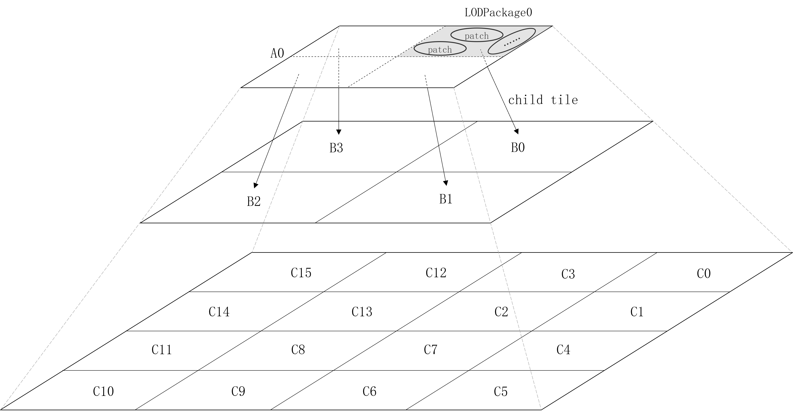
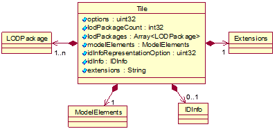

# 空间三维模型瓦片数据格式规范

本文件提供对空间三维模型瓦片数据格式的规范描述。
空间三维模型数据格式的相关规范见[T/CAGIS 1—2019标准文本](./T／CAGIS%201-2019/)。

## 目录
* [简介](#简介)
* [术语和定义](#术语和定义)
* [总体结构](#总体结构)  
    * [瓦片树结构](#瓦片树结构)
    * [数据的文件组成](#数据的文件组成)
        * [必备文件](#必备文件)
        * [可选文件](#可选文件)
        * [文件的组织形式](#文件的组织形式)
* [文件存储格式](#文件存储格式)  
    * [描述文件](#描述文件)
    * [数据文件](#数据文件)
    * [索引树文件](#索引树文件)
    * [属性描述文件](#属性描述文件)
    * [属性数据文件](#属性数据文件)

## 简介

本文件定义了一种开放的空间三维模型瓦片数据格式，不依赖于任何特定的解决方案、技术和产品，适用于空间三维模型瓦片数据的传输、交换与共享，有助于解决空间三维模型瓦片数据在不同终端（移动设备、桌面电脑等）地理信息平台中的存储、高效可视化、共享与互操作等难题。
目前，本文件支持表示以下不同类型的数据：  
* 人工建模数据：采用3ds Max、SketchUp等三维建模软件生产和构建的三维模型数据；  
* 倾斜摄影三维模型数据：采用倾斜摄影技术，经模型重建等技术流程生成的三维模型数据；
* 点云数据：基于激光雷达等获取的三维点云数据；
*	建筑信息模型（Building Information Modeling，BIM）数据：采用BIM设计软件制作的三维模型数据，包括属性信息；
*	二维、三维点/线/面对象数据；
*	二维、三维拓扑网络数据；
*	外挂模型数据。

## 术语和定义
本部分界定了理解文件中某些术语所必需的定义。

* **瓦片 tile**

按照指定的空间范围规则对空间数据进行划分形成的若干数据单元。空间相邻的瓦片之间空间范围可重叠。

* **瓦片树 tiletree**

自上而下逐级划分的、多细节层次的树形空间数据结构，树形结构的每个节点表示一个瓦片。

* **根节点瓦片 root tile**

瓦片树中的元素，是同一棵树中除本身外所有节点的祖先，没有父节点。一个瓦片树有且仅有一个根节点瓦片，其空间范围是所有子节点瓦片的并集。

* **瓦片树集 tiletreeset**

由一个或多个瓦片树构成的集合。

* **细节层次数据包 LOD package**

构成瓦片的数据组成单元，是细节层次切换的最小数据单元。一个瓦片由一个或多个细节层次数据包构成。

* **数据片 patch**

构成细节层次数据包的数据组织单元。每个细节层次数据包包含零个或多个数据片。

* **模型元素 model element**

数据片的基本数据构成，包括骨架、材质、纹理三种元素类型。

* **实例化 instancing**

将有相同几何空间结构，但空间位置、大小和姿态不同的多个模型存储成一个可以被多次引用的模型对象的过程。

* **语义纹理 semantic texture**

一张包含三维模型语义细节的纹理图片，用于存储像素级的语义信息。

* **掩膜纹理 mask texture**

一张通过不同颜色记录三维模型表面不同区域的纹理图片。


## 总体结构
本部分对瓦片树结构、数据的文件组成进行了说明。

### 瓦片树结构

本文件采用树形数据结构组织地理空间数据。一份数据通过瓦片树集（TileTreeSet）来组织，TileTreeSet可包含一个或多个瓦片树（TileTree）。TileTree结构示意如下图所示。

<p align="center">

</p>

> * 以四叉树为例，A0为根节点瓦片（RootTile），B0、B1、B2、B3为A0的子节点Tile，CO、C1、C2、C3为B0的子节点Tile，其他以此类推。  
> * AO由四个细节层次数据包（LODPackage）构成，每个LODPackage由多个数据片（Patch）构成。  
> * LODPackage0挂接了一个child tile，指向下一层级的Tile B0。

TileTree的UML图见下图，具体如下：  

1.	TileTree采用树形数据结构来组织，可包含一个或多个瓦片（Tile），父节点Tile的空间范围是所有子节点Tile空间范围的并集；
2.	每个Tile可包含一个或多个细节层次数据包（LODPackage）；
3.	一个LODPackage可包含零个或多个数据片（Patch），Patch是该LODPackage的实际数据存储单元。每个LODPackage可挂接零个或一个child tile，指向下一层级的Tile。

<p align="center">

</p>

### 数据的文件组成
本部分说明了规定数据的组成文件，并描述了其存储形式、存储规定以及必备性。

#### 必备文件

必备文件包括：  
1.	描述文件。应包含TileTreeSet的描述信息，如版本号、数据的地理范围以及TileTree中RootTile路径等；
2.	数据文件。应包含Tile的数据信息。

#### 可选文件
可选文件包括：  
1.	索引树文件。描述TileTree中各LOD层的文件信息，应包含各Tile的包围盒、LOD切换信息、挂接的子节点文件路径等；
2.	属性描述文件。应包含TileTreeSet中各数据集属性描述信息。数据集描述应符合GB/T 30320的规定；
3.	属性数据文件。应包含TileTree中所有对象的属性数据。

#### 文件的组织形式
各类文件的组织形式见下表。数据可存储在多种数据库中，宜采用键值对(Key-Value)的结构存储。相关示例见[MongoDB存储示例](../Examples/example_MongoDB.md)。

|文件类型|文件命名|说明|必备或可选|
|:---:|:---:|:---|:---:|
|描述文件|TileTreeSet.json或Config.json|TileTreeSet对应一个描述文件|必备|
|数据文件|*.s3mb|一个Tile对应一个数据文件|必备|
|索引树文件|*.json|一个TileTree对应一个或多个索引树文件<br>与TileTree的RootTile同级目录|可选|
|属性描述文件|attribute.json|TileTreeSet对应一个属性数据文件<br>与描述文件同级目录|可选|
|属性数据文件|*.s3md|一个TileTree对应一个属性数据文件 <br> 与TileTree的RootTile同级目录|可选|

> *表示文件名可自定义，其中，索引树文件名和属性描述文件名与RootTile名相同。

## 文件存储格式
本部分定义了描述文件、数据文件、索引树文件、属性描述文件、属性数据文件，并给出了各类文件中存储对象的结构，还规定了各类文件的存储形式及具体内容。

物理存储结构参照OGC WKB的描述形式，通俗易懂。

### 描述文件
描述文件（Config对象）用于描述数据的基本信息。
更多细节见[描述文件存储格式](./scp.json.md)

### 数据文件
数据文件（Tile对象）是数据的主要组成部分，主要由LODPackage、ModelElements、IDInfo和Extensions四个对象构成。Tile对象的UML图见下图。更多细节见[数据文件存储格式](./S3MB/S3MB.md)。



 #### 数据文件各属性含义
 |属性名|类型|描述|
 |:---:|:---:|:---|
 |options|uint32|扩展标识信息，默认值为0。值为1时，表示Tile包含IDInfo对象|
 |lodPackageCount|int32|Tile中LODPackage对象的个数|
 |lodPackages|Array<LODPackage>|Tile中所有LODPackage的集合|
 |modelElements|ModelElements|Tile的模型元素信息集合，用ModelElements对象表示|
 |idInfoRepresentationOption|uint32|IDInfo对象表述格式的标识信息，取值为1时，表示IDInfo对象采用二进制流形式存储；取值为2时，表示IDInfo对象采用JSON格式表述|
 |idInfo|IDInfo|Tile的模型ID信息，用IDInfo对象表示|
 |extensions|String|数据扩展信息字符串（JSON格式）|

#### 数据文件的二进制流描述

数据文件采用二进制流形式存储，采用zip压缩、gzip压缩或不压缩，字节序规定为Little-Endian，即低位字节排放在内存的低地址端。更多细节见[数据文件二进制流描述](./S3MB/S3MBBinary.md)。
数据文件流内容如下：
```
S3MBFile{
  float version;                //数据文件版本号
  uint32 compressedType;        //压缩类型。值为0时，表示不压缩；值为1时，表示zip压缩；值为2时，表示gzip压缩
uint32 uncompressedSize;		//uncompressed package的字节数
  uint32 compressedSize;        //compressed package的字节数
  byte* compressedPackage;      //数据压缩包，长度为compressedSize
};
```
compressedPackage解压缩后，主要包含LODPackages、ModelElements、IDInfo和Extensions四个部分，以及用于标识扩展信息的options和用于标识IDInfo对象表述形式的idInfoRepresentationOption。数据文件二进制数据包示意图见下图。


> 虚线框表示可选模块。


### 索引树文件
索引树文件应包含TileTree中各LOD层的文件信息。更多细节见[索引树文件存储格式](./Indextree.md)。

### 属性描述文件
属性描述文件应描述各图层对象的ID范围及字段信息。更多细节见[属性描述文件存储格式](./attribute.json.md)。

### 属性数据文件
属性数据文件应包含TileTree中各图层的属性描述信息和每个对象的各属性值，采用JSON文件存储，并采用zip压缩，见下图。


属性数据文件的二进制流结构如下：
```
AttributeData{
  uint32 unzippedSize;		//unzipped package的字节数
  uint32 zippedSize;        //zipped package的字节数
  byte* zippedPackage;      //压缩后的属性数据，长度为zippedSize
}
```
zippedPackage解压后，为JSON字符串。更多细节见[属性数据文件存储格式](./S3MD.md)。
